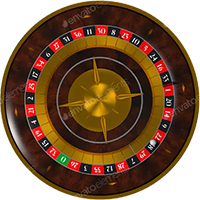
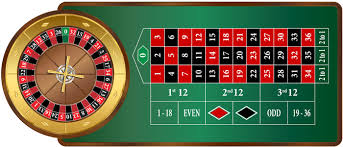

## Challenge 00: HTML Roulette 

### In te leveren bestanden
1) `roulette.html`

### Opdracht
We gaan naar het casino en gaan roulette spelen (de Europeaanse versie)! Om te kunnen beginnen met spelen moeten we echter wel een roulette tafel kunnen zien. Deze tafel ga je tijdens deze challenge maken met HTML en CSS. 

**Zorg ervoor dat je de roulette tafel zo precies mogelijk nabouwt.** Alleen het roulette wheel ziet er iets anders uit, dat is prima. 

Met deze challenge kan je laten zien welke technieken je beheerst. Verschillende delen van de roulette tafel vereisen verschillende technieken. Als je de roulette tafel niet precies nabouwt mis je misschien een aantal technieken waarvan wij graag willen dat je ze laat zien. 

Je mag bij deze challenge **geen** gebruik maken van libraries. Alle HTML en CSS moet je zelf schrijven. 

### Aangeleverde bestanden

### Output

